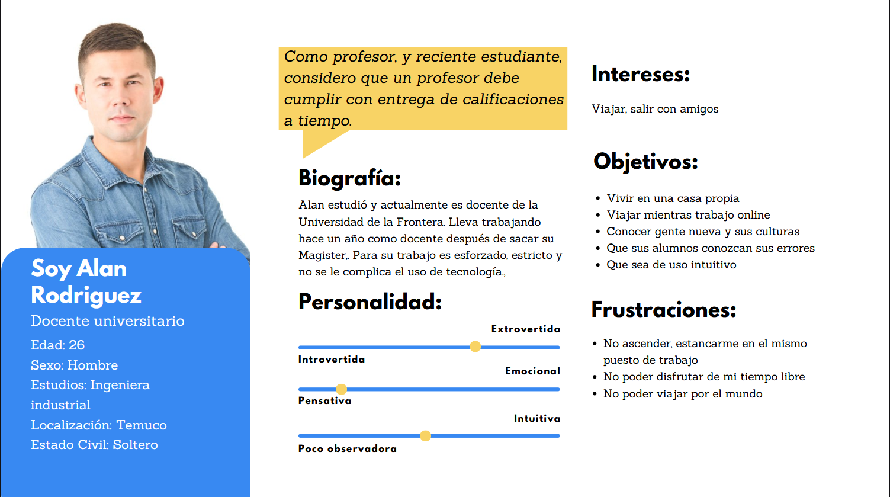
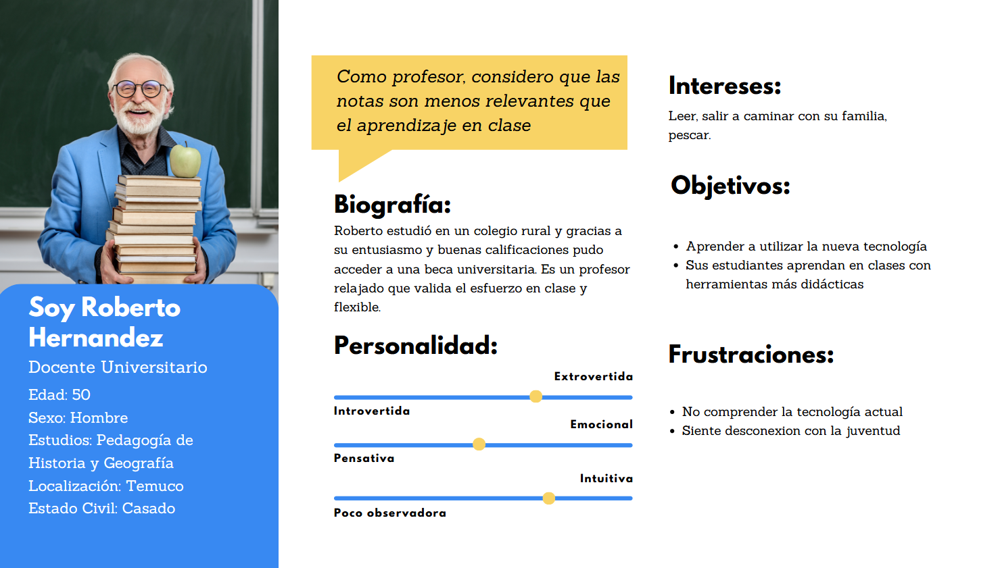
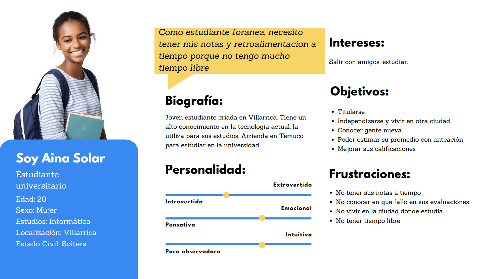

# EvalLoop — Oral Presentation Feedback

A UX design project focused on standardizing and streamlining the oral presentation evaluation process, enabling instructors to deliver structured feedback efficiently and students to act on it meaningfully.

---

## Index

- [1. Introduction](#1-introduction)
  - [1.1 The problem context](#11-the-problem-context)
  - [1.2 The proposed solution](#12-the-proposed-solution)

- [2. Team Members](#2-team-members)

- [3. Strategy Phase](#3-strategy-phase)
  - [3.1 Value Proposition Canvas](#31-value-proposition-canvas)
  - [3.2 UX Personas](#32-ux-personas)

---

## 1. Introduction

### 1.1 The problem context

Feedback on oral presentations arrives late and scattered — rubric scores on spreadsheets, handwritten notes, and follow-up emails rarely reach students in a way they can act on. Even when feedback is delivered, students struggle to connect a low score to a concrete action they should change in their next presentation. The cycle never closes: the same mistakes repeat across deliveries and neither instructor nor student can easily verify whether improvement actually occurred.

> *"As a student who received a low grade on my first presentation, I need to see exactly which criterion I failed and what I should do differently next time, so I don't repeat the same mistake without realising it."*

### 1.2 The proposed solution

EvalLoop is a UX design project that addresses the feedback loop between instructor and student during oral evaluations. The solution focuses on two parallel surfaces:

- **For instructors:** a streamlined, rubric-based evaluation flow that allows them to score criteria and attach specific comments during or immediately after a presentation, minimising the administrative overhead of grading.
- **For students:** a clear, criterion-level feedback view that shows exactly what failed, what a concrete corrective action looks like, and whether performance improved compared to a previous evaluation.

The primary design emphasis is placed on facilitating the instructor's evaluation process, with the student-facing feedback experience designed to translate rubric results into actionable next steps.

---

## 2. Team Members

- [Emilio Jaramillo] Project Lead
- [Yasmin Hernández] Designer
- [Héctor Becerra] Analyst

---

## 3. Strategy Phase

### 3.1 Value Proposition Canvas

A visual representation of what users expect to solve and what the design solution aims to provide. The main pain points identified are the fragmentation of feedback delivery, the lack of criterion-level clarity for students, and the high administrative burden on instructors when evaluating oral presentations. EvalLoop addresses these by centralising rubric-based assessment, surfacing actionable feedback at the criterion level, and enabling instructors to complete evaluations with minimal friction.

---

### 3.2 UX Personas

Three user archetypes were defined to capture the full range of needs across both sides of the evaluation process:

- The early-career instructor who prioritises timely and structured feedback delivery
- The experienced instructor who values student learning over grades and seeks more didactic tools
- The out-of-town student who depends on prompt, clear feedback to manage her academic performance

#### University instructor: Alan Rodríguez (26, Temuco)

> *"As a professor, and a recent student myself, I believe an instructor must deliver grades on time."*

---

#### University instructor: Roberto Hernández (50, Temuco)

> *"As a professor, I believe grades are less relevant than actual learning in the classroom."*

---

#### University student: Aina Solar (20, Villarrica)

> *"As an out-of-town student, I need my grades and feedback on time because I have very little free time."*

---

*Course: User Experience Design | 2026*
